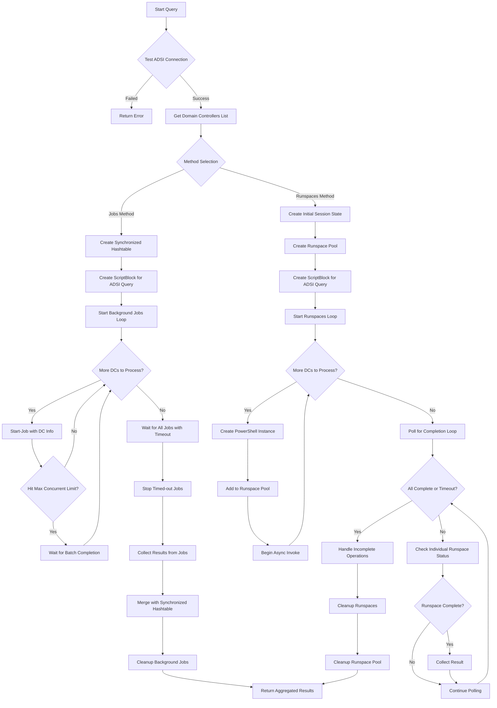
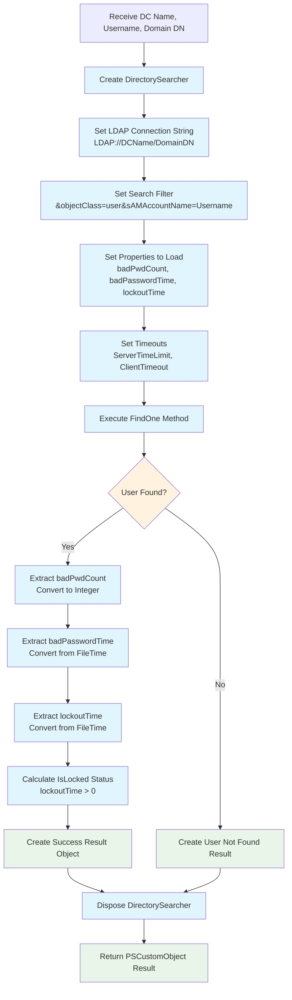

# Parallel ADSI Failed Logon Checker

A PowerShell module for efficiently querying Active Directory failed logon attempts across multiple domain controllers in parallel, using native ADSI without requiring RSAT tools.

## 🎯 Purpose

In Active Directory environments, the `badPwdCount` attribute is **not replicated** between domain controllers. Each DC maintains its own count of failed authentication attempts. To get accurate failed logon statistics, you must query **all** domain controllers and aggregate the results.

This tool provides two high-performance parallel methods to accomplish this task:
- **Background Jobs**: Compatible, moderate overhead
- **Runspaces**: Higher performance, lower overhead

## 📋 Prerequisites

- PowerShell 5.1 or later
- Domain-joined machine OR credentials for AD access
- Network connectivity to all domain controllers
- Appropriate permissions to read user attributes in Active Directory

## 🚀 Quick Start

```powershell
# Load the script
. .\ParallelADSIChecker.ps1

# Test connectivity
Test-ADSIConnection

# Check if user exists (optional but recommended)
Test-UserExists -Username "jdoe"

# Run the query (runspaces method - typically faster)
$results = Get-UserFailedLogonsRunspace -Username "jdoe"
Show-FailedLogonSummary -Results $results -Username "jdoe"
```

## 📊 Algorithm Overview



## 🔧 Core Functions

### `Get-UserFailedLogonsJobs`
Uses PowerShell background jobs for parallel execution.

**Parameters:**
- `Username` (required): sAMAccountName of the user to check
- `DomainDN` (optional): Domain distinguished name (auto-detected)
- `TimeoutSeconds` (default: 30): Timeout for individual DC queries
- `MaxConcurrentJobs` (default: 10): Maximum parallel jobs

**Example:**
```powershell
$results = Get-UserFailedLogonsJobs -Username "jdoe" -TimeoutSeconds 20 -MaxConcurrentJobs 5
```

### `Get-UserFailedLogonsRunspace` 
Uses PowerShell runspaces for maximum performance.

**Parameters:**
- `Username` (required): sAMAccountName of the user to check
- `DomainDN` (optional): Domain distinguished name (auto-detected)
- `TimeoutSeconds` (default: 30): Timeout for individual DC queries
- `MaxRunspaces` (default: 10): Maximum parallel runspaces

**Example:**
```powershell
$results = Get-UserFailedLogonsRunspace -Username "jdoe" -TimeoutSeconds 20 -MaxRunspaces 8
```

## 📈 Individual DC Query Algorithm

Each parallel worker executes this ADSI query process:



## 🏆 Performance Comparison

| Method | Pros | Cons | Best For |
|--------|------|------|----------|
| **Background Jobs** | - PowerShell 5.1 compatible<br/>- Isolated execution<br/>- Built-in error handling | - Higher memory overhead<br/>- Job serialization costs<br/>- Slower startup | - Legacy environments<br/>- Maximum compatibility |
| **Runspaces** | - Lower memory footprint<br/>- Faster execution<br/>- Direct object sharing | - More complex cleanup<br/>- Shared process space | - Performance-critical scenarios<br/>- Modern environments |

## 📋 Result Object Structure

Each DC query returns a `PSCustomObject` with:

```powershell
@{
    DomainController    = "DC01.domain.com"
    BadPasswordCount    = 3
    BadPasswordTime     = [DateTime] or $null
    LockoutTime         = [DateTime] or $null  
    IsLocked           = $true/$false
    Success            = $true/$false
    Error              = $null or "Error message"
    QueryDurationMs    = 245
}
```

## 🛠️ Helper Functions

### `Test-ADSIConnection`
Validates basic ADSI connectivity and domain access.

```powershell
$connection = Test-ADSIConnection
if ($connection.Success) {
    Write-Host "Domain: $($connection.DomainName)"
    Write-Host "DCs found: $($connection.DCCount)"
}
```

### `Test-UserExists`
Quick validation that a user exists before running expensive parallel queries.

```powershell
if (Test-UserExists -Username "jdoe") {
    # Proceed with parallel queries
}
```

### `Show-FailedLogonSummary`
Formats and displays comprehensive results with statistics.

```powershell
Show-FailedLogonSummary -Results $results -Username "jdoe"
```

### `Invoke-FailedLogonTest`
Test harness for comparing both methods and validating functionality.

```powershell
# Compare performance of both methods
Invoke-FailedLogonTest -Username "testuser" -ComparePerformance

# Just run runspaces method with detailed output  
Invoke-FailedLogonTest -Username "testuser"
```

## 🔍 Thread Safety & Synchronization

### Background Jobs Approach
- Uses `[hashtable]::Synchronized(@{})` for thread-safe result collection
- Each job writes to both job output stream and synchronized hashtable
- Dual collection ensures no result loss if job serialization fails

### Runspaces Approach  
- Direct polling of `AsyncResult.IsCompleted` status
- Results collected immediately upon completion
- Lower overhead but requires careful resource management

## ⚡ Performance Tuning

### Optimal Concurrency Settings
```powershell
# For small domains (2-5 DCs)
-MaxConcurrentJobs 3
-MaxRunspaces 3

# For medium domains (6-15 DCs)  
-MaxConcurrentJobs 8
-MaxRunspaces 8

# For large domains (16+ DCs)
-MaxConcurrentJobs 10
-MaxRunspaces 12
```

### Timeout Considerations
```powershell
# Fast local network
-TimeoutSeconds 15

# WAN or slow network
-TimeoutSeconds 45  

# Unreliable network
-TimeoutSeconds 60
```

## 🐛 Troubleshooting

### Common Issues

**"User not found" errors:**
```powershell
# Verify user exists first
Test-UserExists -Username "problematicuser"

# Check domain DN detection
$connection = Test-ADSIConnection
Write-Host "Detected Domain DN: $($connection.DomainDN)"
```

**Timeout issues:**
```powershell
# Increase timeout for slow DCs
$results = Get-UserFailedLogonsRunspace -Username "user" -TimeoutSeconds 45

# Check individual DC response times
$results | Sort-Object QueryDurationMs -Descending | Select-Object DomainController, QueryDurationMs, Success
```

**Permission errors:**
- Ensure account has read permissions to user objects
- Verify network connectivity to all DCs
- Check firewall rules for LDAP (389) and LDAPS (636)

**Memory issues with large DC counts:**
```powershell
# Reduce concurrent operations
$results = Get-UserFailedLogonsRunspace -Username "user" -MaxRunspaces 5

# Use Jobs method for better isolation
$results = Get-UserFailedLogonsJobs -Username "user" -MaxConcurrentJobs 5
```

## 📊 Example Output

```
=== Failed Logon Summary for 'jdoe' ===
Successfully queried DCs: 4
Failed DC queries: 0

Total failed logons across all DCs: 7
Highest count on single DC: 3 (DC02.contoso.com)
Latest failed attempt: 8/27/2025 2:15:43 PM on DC03.contoso.com
Account status: Not locked
Average query time: 156.25 ms

=== Detailed Results ===
DomainController     BadPasswordCount BadPasswordTime      IsLocked QueryDurationMs
----------------     ---------------- ---------------      -------- ---------------
DC02.contoso.com                    3 8/27/2025 1:45:21 PM    False             143
DC01.contoso.com                    2 8/27/2025 2:10:15 PM    False             167
DC03.contoso.com                    2 8/27/2025 2:15:43 PM    False             201
DC04.contoso.com                    0                         False             114
```

## 🔒 Security Considerations

- Script uses current user's credentials by default
- No credential caching or storage
- Minimal LDAP attributes requested (only badPwd*, lockout*)
- Read-only operations (no AD modifications)
- Respects AD security permissions

## 📝 Version History

- **v1.0**: Initial implementation with Jobs and Runspaces methods
- Comprehensive error handling and resource cleanup
- Thread-safe result collection
- Performance monitoring and comparison tools

## 🤝 Contributing

When contributing to this project:
1. Test both methods against multiple DC environments
2. Validate PowerShell 5.1 compatibility  
3. Include performance impact analysis
4. Update documentation and examples

## ⚠️ Limitations

- Requires network connectivity to all domain controllers
- Performance depends on slowest responding DC
- Large domains (50+ DCs) may require timeout adjustments
- Some very old DCs may not support all LDAP timeout properties

---

*This tool eliminates the guesswork from AD failed logon investigation by providing accurate, aggregated data from all domain controllers in your environment.*
